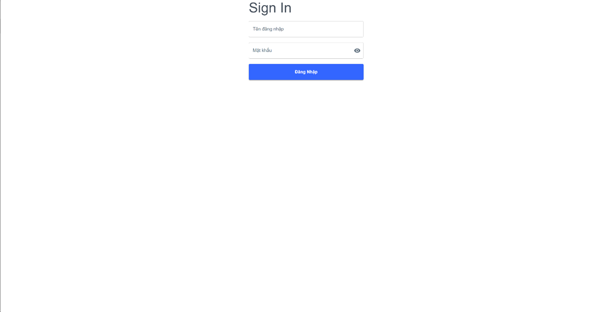
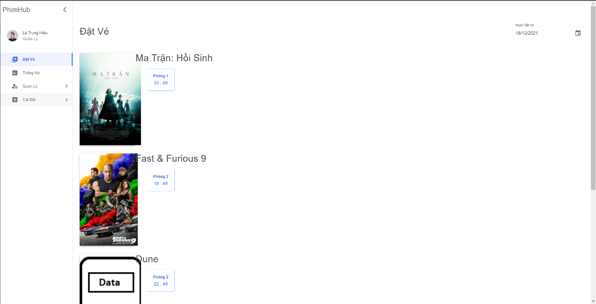
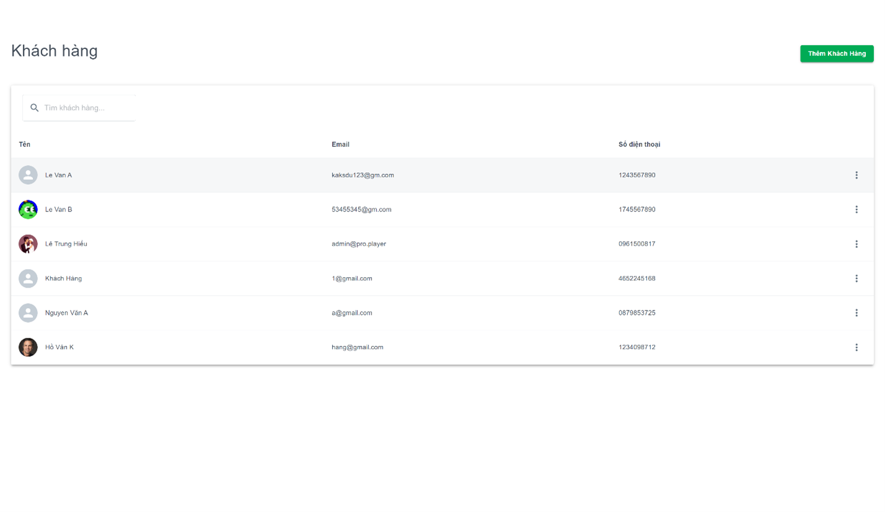
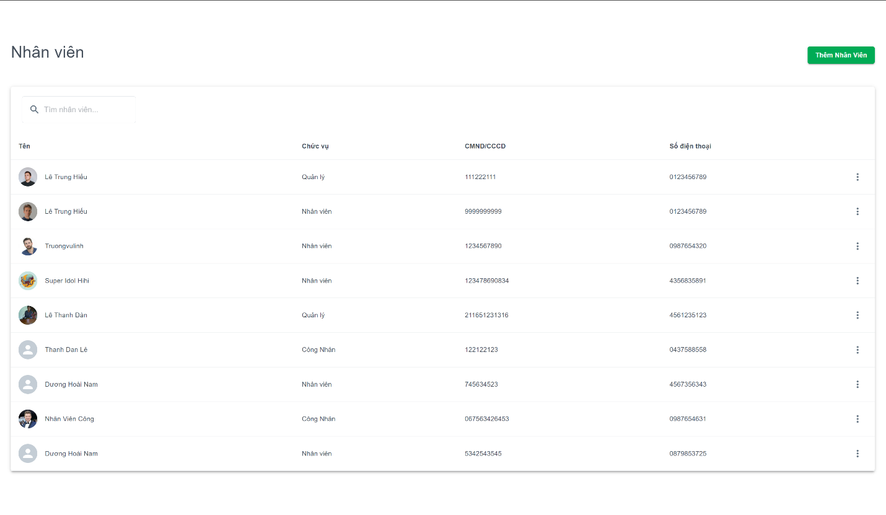
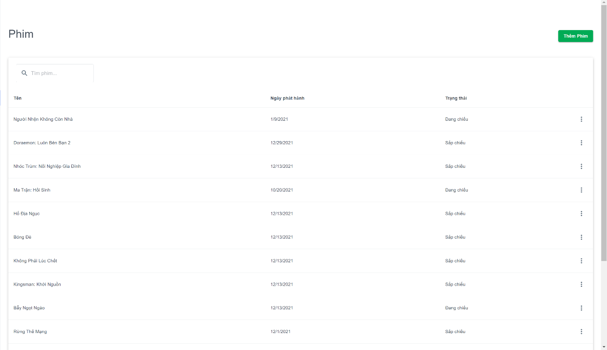
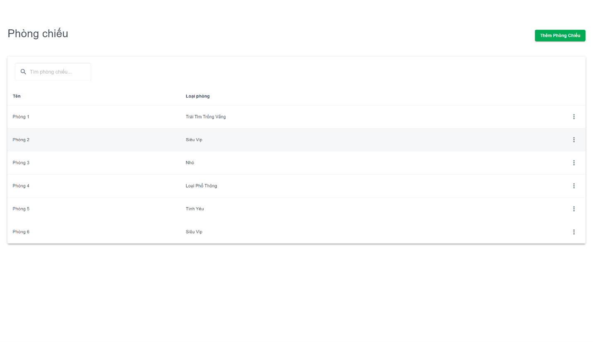
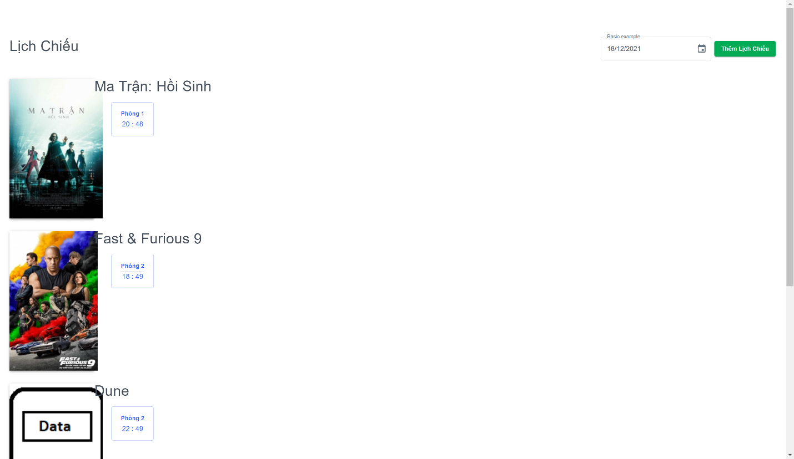
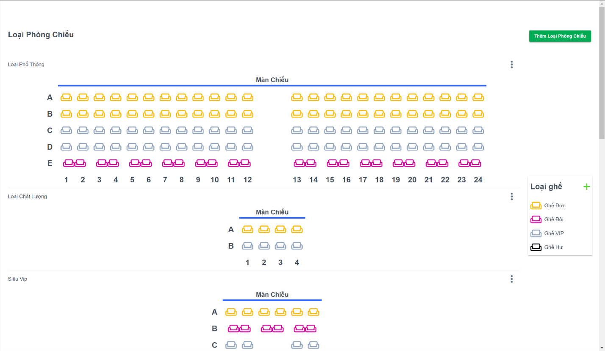
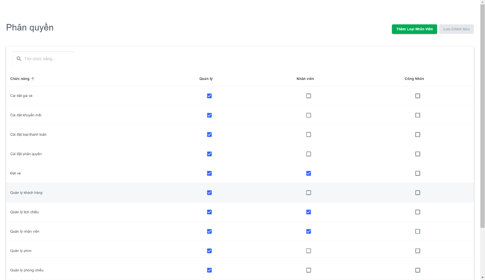

# PhimHub
A Website For Cinema Management
## Feature
- Issue invoices
- Arrange movie showtimes
- Revenue report
- Movie/Employee/Customer/Room searching
- Regulation changing
## Tech Stack
**Front-end:** ReactJS

**Back-end:** NodeJS

**Database:** MongoDB
## Installation
- Clone the project
- Install NodeJS on your computer
- Go to the project directory and run these commands on terminal:
```
cd server
npm install
npm run server

cd client
npm install
npm start
```
- Enjoy it
## Author
- Lê Thành Luân
- Lê Thanh Dàn
- Lê Trung Hiếu
- Dương Hoài Nam
## Screenshots










